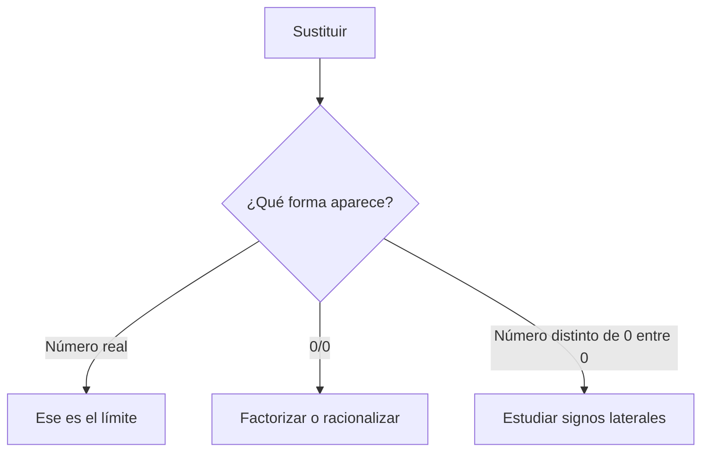

# AGENTS.md

Instructions for AI agents working in this repository.

## Embedding YouTube videos in Markdown

GitHub strips `<iframe>` tags from rendered Markdown, so a real embedded
player is not possible. The convention in this repo is a **clickable
thumbnail** that links out to YouTube:

```
[](https://www.youtube.com/watch?v=VIDEO_ID "Título del vídeo")
```

- `https://img.youtube.com/vi/VIDEO_ID/hqdefault.jpg` is YouTube's official
  thumbnail CDN and works for any valid video ID without needing scraping.
- **Never guess or fabricate a `VIDEO_ID`.** Only use IDs confirmed via an
  actual web search result (a real URL you observed), never invented from
  memory — a wrong ID silently links to an unrelated or nonexistent video.
- Prefer well-known, reputable educational channels for the subject.

## Math notation convention (GitHub Flavored Markdown)

All `.md` files in this repo must use **GitHub's supported math syntax** for LaTeX
expressions, per the official docs:
https://docs.github.com/en/get-started/writing-on-github/working-with-advanced-formatting/writing-mathematical-expressions

- **Inline math:** wrap the expression in single dollar signs.
  ```
  This sentence uses `$` delimiters to show math inline: $\sqrt{3x-1}+(1+x)^2$
  ```
- **Block math:** start a new line and wrap the expression in double dollar signs
  (`$$`), each on its own line.
  ```
  $$
  \lim_{x\to2}(3x^2-5x+4)
  $$
  ```
- Do **NOT** use LaTeX-only delimiters `\(...\)` (inline) or `\[...\]` (block) —
  GitHub does not render these. Always use `$...$` and `$$...$$` instead.
- To show a literal `$` inside a math expression, escape it: `\$`. Outside a math
  expression on the same line, wrap it in `<span>$</span>`.

When creating or editing any markdown file in this repo, follow this convention
consistently. If you find `\(`, `\)`, `\[`, or `\]` used as math delimiters in
existing files, convert them to `$` / `$$`.

- **Avoid wrapping inline math in redundant literal parentheses**, especially
  inside bold/italic text — e.g. `**...($Q(x)$)...**` renders oddly. Just
  write `**...$Q(x)$...**` without the extra `(` `)` around the `$...$` span.

## Generating graphs / Cartesian plane images

GitHub Markdown (MathJax) can render math **notation**, but it cannot draw
graphs or plots. Any Cartesian-plane graph or function drawing must be
generated as a **static PNG image** with Python (matplotlib) and embedded with
standard Markdown image syntax — never attempt to "draw" a graph using math
delimiters, Mermaid, or ASCII art.

### Setup

A local venv already exists at `.venv/` with `matplotlib` and `numpy`
installed. Reuse it instead of creating a new one:

```
source .venv/bin/activate
```

If it doesn't exist yet:

```
python3 -m venv .venv && source .venv/bin/activate
pip install matplotlib numpy
```

### Where things live

- Script that generates all graphs: [scripts/generate_graphs.py](scripts/generate_graphs.py)
- Output images:
  - `calculo1/limites/img/` — graphs for the exam/solutions/theory (e.g. `ejercicio1.png`)
  - `calculo1/limites/pre-saberes/img/` — graphs for prerequisite/function-type docs (e.g. `lineal.png`)

### Adding a new graph

1. Add a new plotting block to `scripts/generate_graphs.py` following the
   existing pattern: use the `new_axes(xlim, ylim, title)` helper to create
   consistent axes (with x/y axis lines and grid), plot the function, mark
   any asymptote (vertical with `ax.axvline`, horizontal with `ax.axhline`,
   dashed, red for asymptotes / green for horizontal asymptotes) or "hole"
   (open circle marker), then save with `save(fig, "<path>.png")`.
   - Split the domain into separate `np.linspace` ranges around any
     discontinuity/asymptote so matplotlib doesn't draw a vertical line
     connecting the two branches.
2. Re-run the script to regenerate **all** images (fast, safe to re-run):
   ```
   source .venv/bin/activate && python3 scripts/generate_graphs.py
   ```
3. Embed the image in the relevant `.md` file(s) using a relative path from
   that file's own directory, e.g.:
   ```
   
   ```
4. View the generated PNG (e.g. with the image-viewing tool) to sanity-check
   the plot before considering the task done.

## Generating explanatory animations with Manim

Use a GIF only when motion clarifies a changing quantity, an approach from two
sides, or a sequence of algebraic transformations. Keep static definitions and
single-state graphs as PNGs.

- Generator: [scripts/generate_animations.py](scripts/generate_animations.py)
- Final output: `calculo1/limites/animaciones/`
- Intermediate Manim files: `.manim-media/` (ignored by Git)

Install the Python dependencies from `requirements.txt`. On macOS, the Manim
runtime also needs `cairo`, `pango`, and `ffmpeg` (available through Homebrew).
Generate every animation with:

```bash
.venv/bin/python scripts/generate_animations.py
```

Embed a GIF with a relative path from the Markdown document, add descriptive
alternative text, and reuse an animation when it explains the same concept in
several documents. Before finishing, inspect frames from the beginning, middle,
and end to catch clipped labels, overlap, or points leaving the axes.

## Didactic resources beyond images and animations

Choose the smallest resource that directly supports the learning objective.
Every document must remain understandable from its prose and formulas alone:
diagrams, callouts, hidden answers, and notebooks supplement the explanation;
they must not contain essential information that is absent from the text.

### Resource selection

| Learning need | Preferred resource |
|---|---|
| Compare exact values, signs, or cases | Markdown table |
| Choose between several solution methods | Mermaid decision tree |
| Show a short warning or decisive idea | GitHub alert |
| Let the student attempt a problem before seeing help | Collapsed `<details>` section |
| Practise recall after a topic | Self-assessment questions with hidden answers |
| Experiment with parameters or execute calculations | Optional Jupyter notebook |
| Show one static function or geometric state | PNG generated with Python |
| Show change, movement, or a transformation sequence | GIF generated with Manim |

Do not repeat the same information in several formats unless each format has a
clear purpose. Avoid decorative resources that interrupt the study flow.

### Collapsed hints and solutions

Use `<details>` to hide hints, worked solutions, or optional derivations so the
student can try first. Never hide a definition, theorem, prerequisite, or final
conclusion that is required to understand the main explanation.

```html
<details>
<summary>Ver pista</summary>

Estudia primero qué ocurre al sustituir directamente.

</details>
```

- Put a blank line after `<summary>` and before `</details>` so Markdown inside
  the section renders correctly.
- Use a specific label such as `Ver pista`, `Comprobar resultado`, or
  `Ver solución razonada`; avoid vague labels such as `Más`.
- Keep hints shorter than full solutions. A hint should identify the next useful
  step without giving away the entire calculation.
- Keep these sections collapsed by default. Use `<details open>` only when the
  content is supplementary rather than an answer.
- Preserve the repository's `$...$` and `$$...$$` math conventions inside the
  block, including blank lines around display equations.

### Self-assessment

When a topic teaches a skill, finish with 3–5 short questions that progress from
recognition to application. Ask the student to predict or calculate before
opening the answer. Put each answer in a collapsed `<details>` section and
explain the decisive step, not only the final value.

Good question types include:

- identifying the applicable method and explaining why;
- predicting a sign or a one-sided behavior before calculating;
- spotting and correcting a plausible mistake;
- comparing $f(a)$ with $\lim_{x\to a}f(x)$;
- solving a short variation of the worked example.

Do not turn every paragraph into a quiz. Questions should test the section's
learning objectives and should not introduce unprepared notation.

### Mermaid diagrams

Use Mermaid for decision trees, workflows, and relationships made of labeled
nodes and arrows. It is particularly useful for showing how to choose a limit
method. Do not use Mermaid for Cartesian plots, accurately scaled geometry, or
long algebraic derivations.

````markdown

````

- Prefer `flowchart TD` for a study sequence and `flowchart LR` only when the
  horizontal version remains readable on a narrow screen.
- Keep diagrams focused, normally 5–10 nodes, with short quoted labels.
- Avoid complex LaTeX inside Mermaid nodes; put detailed formulas in the prose
  immediately before or after the diagram.
- State the same decision logic in accessible text near the diagram.
- Validate the diagram with the Mermaid version rendered by GitHub before
  considering the change complete.

### GitHub alerts

Use alerts only for information that deserves to interrupt the reading flow.
Prefer these meanings:

- `[!TIP]` for a useful shortcut or checking technique;
- `[!IMPORTANT]` for an idea required to solve the problem correctly;
- `[!WARNING]` for a common mistake that leads to an invalid result;
- `[!NOTE]` for brief supporting context.

```markdown
> [!WARNING]
> La forma $0/0$ es una indeterminación, no el valor del límite.
```

Use at most one or two alerts per article, never place alerts consecutively,
and keep each one to one or two sentences. Do not use alerts as decoration or
as a substitute for explaining the idea in the main text.

### Tables for values, signs, and method comparison

Use Markdown tables when exact mappings or comparisons are easier to scan than
prose. For limits, useful tables include nearby $x$ values, the sign of each
factor, approximate $f(x)$ values, and comparisons between indeterminate forms.

- Label every column and identify the side of approach when relevant.
- Order numerical values in the same direction as the approach.
- Include enough values to reveal the trend, but normally no more than 5–7 rows.
- Use a dash or `no definida` for a value that does not exist; never write a
  fabricated value at a forbidden point.
- Follow the table with one sentence stating the pattern the student should see.
- A numerical table supports intuition; it does not replace an algebraic or
  sign-based justification.

### Optional Jupyter notebooks

Add an `.ipynb` notebook only when executing or changing parameters provides a
clear benefit beyond the Markdown explanation. GitHub renders notebooks as
static documents, so JavaScript widgets and other interactive behavior must not
be required to understand the result.

- Keep the corresponding Markdown lesson self-contained and link the notebook
  as optional experimentation.
- Use deterministic examples, short cells, and explanatory Markdown cells.
- Put reusable dependencies in `requirements.txt`; do not rely on packages that
  are installed only on one machine.
- Ensure `Restart Kernel and Run All` succeeds from a clean environment.
- Keep important outputs visible in the committed notebook, but remove noisy
  logs, temporary data, and unnecessarily large embedded media.
- If full interactivity requires a local notebook server or an external service,
  say so explicitly and provide a non-interactive explanation in the lesson.

### Final educational-content checks

Before completing any teaching-material change:

1. Read the section in study order and verify that every new term is introduced
   before it is used.
2. Check all local links and media paths relative to the Markdown file.
3. Verify that every `$$` delimiter is on its own line with a blank line before
   and after the math block.
4. Check that every `<details>` and fenced code block is correctly closed.
5. Render every Mermaid diagram and inspect every generated image or GIF.
6. Confirm that visual resources have descriptive alternative text and an
   equivalent explanation in prose.
7. Make sure hidden answers, alerts, and diagrams improve active study without
   making the main explanation harder to scan.
