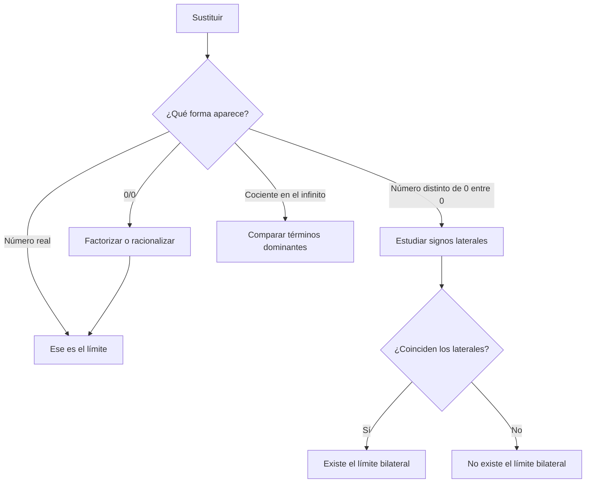

# 📚 Teoría necesaria — Límites (para sacar un 10)

---

## 1. Concepto de límite (Ejercicio 8)

$$
\lim_{x\to a}f(x)=L
$$

significa que **podemos hacer que $f(x)$ esté tan cerca de $L$ como queramos tomando $x$ suficientemente cerca de $a$, con $x\ne a$**.

Puntos clave para justificar:

- **No hace falta que $f(a)$ exista, ni que $f(a)=L$**. El límite describe el comportamiento *alrededor* de $a$, no el valor *en* $a$.
- Ejemplo típico: $f(x)=\dfrac{x^2-9}{x-3}$ no está definida en $x=3$, pero $\lim_{x\to3}f(x)=6$.
- El límite bilateral $\lim_{x\to a}f(x)$ **existe si y solo si** los dos límites laterales existen y son iguales:

$$
\lim_{x\to a^-}f(x)=\lim_{x\to a^+}f(x)=L
$$

---

## 2. Sustitución directa (Ejercicio 1)

Si $f$ es una función "normal" (polinomio, racional sin anular el denominador, etc.) y es continua en $a$, entonces:

$$
\lim_{x\to a}f(x)=f(a)
$$

Para polinomios **siempre** se puede sustituir directamente. Pasos:

1. Sustituye $x=a$ en la expresión.
2. Opera con cuidado el signo y las potencias.

**Ejemplo:** $\lim_{x\to2}(3x^2-5x+4)=3(2)^2-5(2)+4=12-10+4=6$

---

## 3. Indeterminación $0/0$ (Ejercicio 2)

Ocurre cuando al sustituir, numerador y denominador dan 0.

> [!WARNING]
> $0/0$ no es el valor del límite. Es una forma indeterminada: expresiones diferentes con esa misma forma pueden tener límites distintos o no tener límite.

**Estrategia:** factorizar y simplificar el factor que anula.

Técnicas de factorización útiles:

- Diferencia de cuadrados: $a^2-b^2=(a-b)(a+b)$
- Sacar factor común
- Trinomio / Ruffini: si $x=a$ anula el polinomio, $(x-a)$ es un factor
- Multiplicar por el conjugado (si hay raíces): $\dfrac{1}{\sqrt{x}-\sqrt{a}}\cdot\dfrac{\sqrt{x}+\sqrt{a}}{\sqrt{x}+\sqrt{a}}$

**Pasos a responder siempre:**

1. Qué pasa al sustituir → $0/0$
2. Tipo de indeterminación → $0/0$
3. Transformación (factorizar y simplificar)
4. Resultado (sustituir en la expresión simplificada)

**Ejemplo:**

$$
\lim_{x\to3}\frac{x^2-9}{x-3}=\lim_{x\to3}\frac{(x-3)(x+3)}{x-3}=\lim_{x\to3}(x+3)=6
$$

La cancelación usa factores completos y solo es válida para $x\ne3$. Eso basta para el límite, porque este estudia lo que ocurre cerca del punto.

---

## 4. Límites laterales e infinitos con denominador que se anula (Ejercicios 3 y 6)

Cuando al sustituir el denominador da 0 **pero el numerador no da 0**, el límite es infinito ($+\infty$ o $-\infty$), no una indeterminación.

**Cómo saber el signo:**

1. Evalúa el signo del numerador cerca del punto (normalmente es un número fijo, positivo o negativo).
2. Estudia el signo del denominador **por cada lado**:
   - Por la izquierda ($x\to a^-$): usa un valor un poco menor que $a$.
   - Por la derecha ($x\to a^+$): usa un valor un poco mayor que $a$.
3. Aplica la regla de signos: $\dfrac{+}{0^+}\to+\infty$, $\dfrac{+}{0^-}\to-\infty$, $\dfrac{-}{0^+}\to-\infty$, $\dfrac{-}{0^-}\to+\infty$.

**Ejemplo (Ejercicio 6):** $f(x)=\dfrac{1}{x-2}$

- $x\to2^-$: $x-2\to0^-$ (negativo) → $\dfrac{1}{0^-}\to-\infty$
- $x\to2^+$: $x-2\to0^+$ (positivo) → $\dfrac{1}{0^+}\to+\infty$
- Los laterales son distintos → **no existe** el límite bilateral.
- Hay **asíntota vertical** en $x=2$ (siempre que un límite lateral sea infinito).

**Ejemplo (Ejercicio 3):** $f(x)=\dfrac{x^2+x+2}{x+1}$, numerador en $x=-1$ vale $2>0$.

- $x\to-1^-$: $x+1\to0^-$ → $\dfrac{2}{0^-}\to-\infty$
- $x\to-1^+$: $x+1\to0^+$ → $\dfrac{2}{0^+}\to+\infty$
- Distintos → no existe el límite; asíntota vertical en $x=-1$.

**Regla práctica para el signo del denominador:** factoriza si puedes, o simplemente sustituye un número muy cercano a $a$ por ese lado (ej. $a-0.01$ o $a+0.01$) y mira el signo.

> [!TIP]
> Antes de escribir un infinito, prepara una tabla de signos del numerador y del denominador a cada lado del punto.

---

## 5. Límites en el infinito de funciones racionales (Ejercicios 4 y 5)

Sea $\dfrac{P(x)}{Q(x)}$ con $P$ de grado $n$ y $Q$ de grado $m$, cuando $x\to\pm\infty$:

| Comparación de grados | Resultado |
|---|---|
| $n = m$ (mismo grado) | límite = cociente de los **coeficientes principales** |
| $n < m$ (numerador de grado menor) | límite = $0$ |
| $n > m$ (numerador de grado mayor) | el cociente crece sin cota; hay que determinar el signo |

**Método seguro:** compara primero los términos principales. Para justificar el resultado algebraicamente, divide numerador y denominador entre $x^{\max(n,m)}$ y usa que $1/x^k\to0$ para $k>0$. Si $n>m$, el comportamiento dominante es

$$
\frac{a_nx^n}{b_mx^m}=\frac{a_n}{b_m}x^{n-m},
$$

por lo que el signo depende del cociente $a_n/b_m$ y, cuando $x\to-\infty$, también de si $n-m$ es par o impar.

**Ejemplo (Ejercicio 4), mismo grado (n=m=2):**

$$
\lim_{x\to+\infty}\frac{4x^2-3x+1}{2x^2+5x-7}=\frac{4}{2}=2
$$

(cociente de los coeficientes de $x^2$)

**Ejemplo (Ejercicio 5), grado numerador (1) < grado denominador (2):**

$$
\lim_{x\to+\infty}\frac{3x+2}{x^2-1}=0
$$

(el denominador crece mucho más rápido que el numerador, por lo que la fracción tiende a 0)

---

## 6. Límites trigonométricos con discontinuidades (Ejercicio 7)

La tangente $\tan(x)=\dfrac{\sin x}{\cos x}$ tiene asíntotas verticales donde $\cos x=0$, es decir en $x=\dfrac{\pi}{2}+k\pi$.

Cerca de $x=\dfrac{\pi}{2}$: $\sin x\to1$ (positivo), y hay que estudiar el signo de $\cos x$:

- $x\to\dfrac{\pi}{2}^-$ (ángulos un poco menores, en el 1er cuadrante): $\cos x\to0^+$ → $\tan x\to+\infty$
- $x\to\dfrac{\pi}{2}^+$ (ángulos un poco mayores, en el 2º cuadrante): $\cos x\to0^-$ → $\tan x\to-\infty$

Como los laterales son distintos ($+\infty\neq-\infty$), **no existe** $\lim_{x\to\pi/2}\tan x$. Asíntota vertical en $x=\dfrac{\pi}{2}$.

---

## 7. Resumen / checklist antes del examen

Este árbol resume la decisión. Primero se sustituye y después se identifica la forma obtenida:

1. **Sustituir siempre primero.** Si da un número → ese es el límite.
2. Si da $0/0$ → factorizar/simplificar (o racionalizar con conjugado si hay raíces).
3. Si da $\dfrac{\text{número}\neq0}{0}$ → límite infinito; estudiar signo por cada lado para saber si es $+\infty$ o $-\infty$.
4. Límites laterales distintos ⇒ el límite bilateral **no existe**, y suele haber **asíntota vertical**.
5. En $x\to\pm\infty$ con fracciones de polinomios: comparar grados (mismo grado → cociente de coeficientes; numerador menor → 0; numerador mayor → estudiar el término dominante y su signo).
6. Para trigonométricas con división por cero: usar el signo de $\sin$/$\cos$ en cada cuadrante cercano al punto.
7. Recordar que el límite es sobre el **comportamiento cercano**, no sobre el valor exacto en el punto (puede no coincidir o no existir $f(a)$).

El árbol no reemplaza la justificación: después de elegir una rama, escribe la transformación algebraica o el estudio de signos correspondiente.

---

## Comprueba lo aprendido

**1. ¿Qué método usarías si la sustitución produce $0/0$ y aparecen raíces?**

Comprobar respuesta

Probaría a racionalizar con el conjugado. El objetivo es transformar la expresión para encontrar y simplificar el factor que provoca el $0/0$.

**2. Calcula $\displaystyle\lim_{x\to2}\dfrac{x^2-4}{x-2}$.**

Ver solución razonada

La sustitución produce $0/0$. Factorizamos y simplificamos para $x\ne2$:

$$
\frac{x^2-4}{x-2}=\frac{(x-2)(x+2)}{x-2}=x+2.
$$

Por tanto, el límite vale $4$.

**3. ¿Existe $\displaystyle\lim_{x\to0}1/x$?**

Ver solución razonada

No. Por la izquierda, $1/x\to-\infty$; por la derecha, $1/x\to+\infty$. Como los laterales no coinciden, el límite bilateral no existe.

**4. Si una función cumple $f(3)=10$ pero se aproxima a $6$ por ambos lados de $3$, ¿cuál es el límite?**

Comprobar respuesta

El límite es $6$. El valor aislado $f(3)=10$ no cambia el comportamiento de la función alrededor de $3$.

## Laboratorio opcional

El [laboratorio de límites con Python](laboratorio-limites.ipynb) permite modificar los puntos de aproximación y observar tablas y gráficas. Úsalo para formular conjeturas; la respuesta del examen debe seguir incluyendo la justificación matemática.
