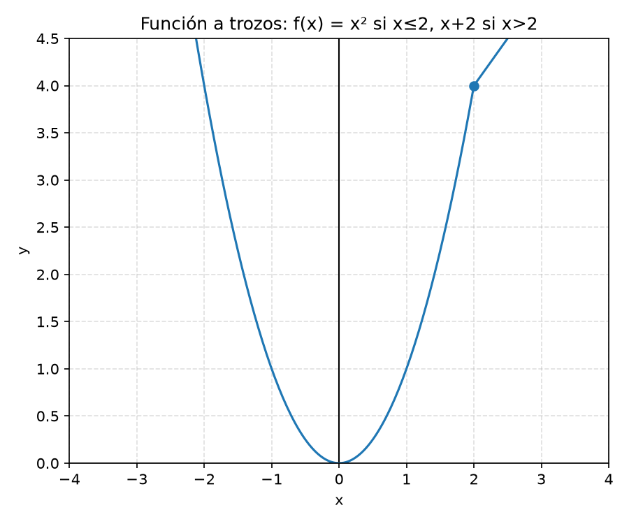
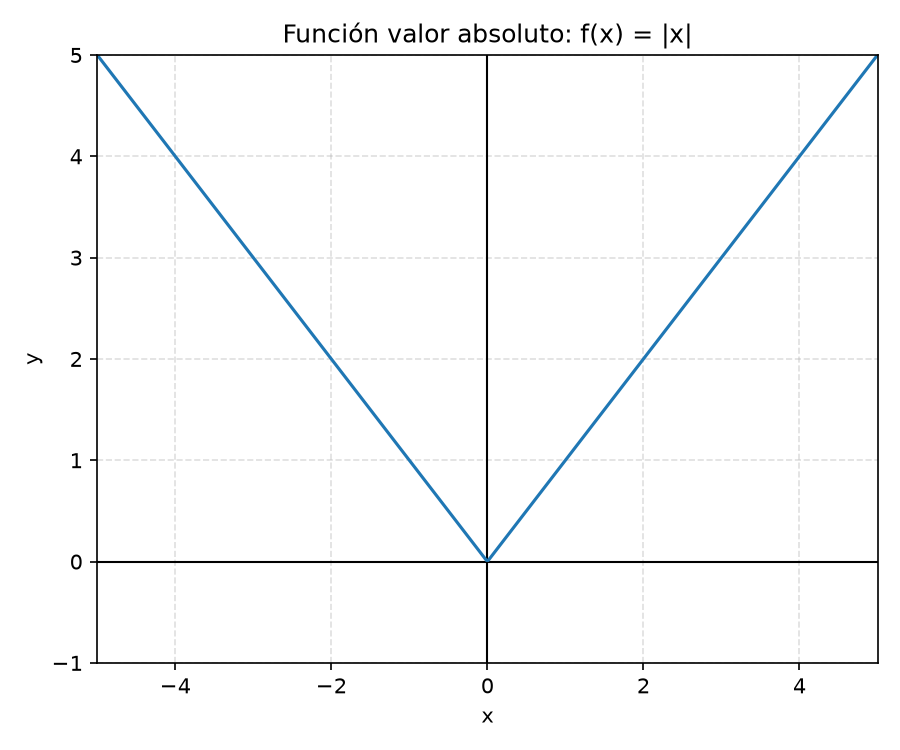
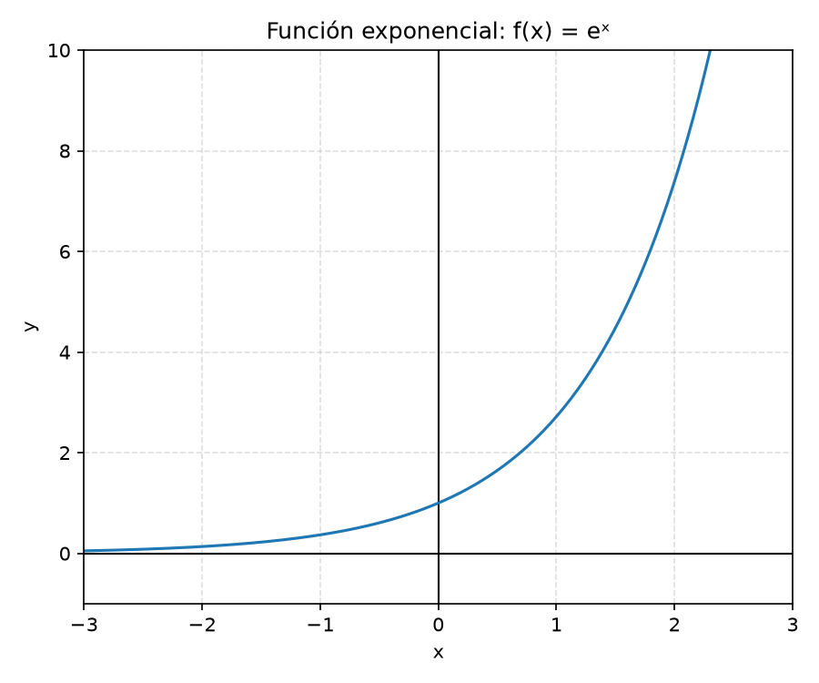
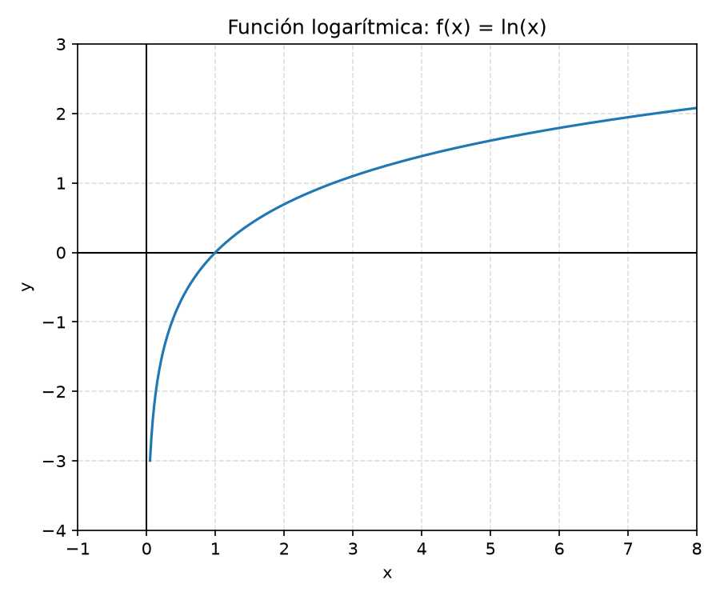

# 4️⃣ Funciones: concepto y tipos (explicado paso a paso)

Una función es como una **máquina**: le metes un número por un lado, y por el otro sale otro número, siguiendo siempre la misma regla.

---

## ¿Qué es una función?

Imagina una máquina que a cada número que le des, le suma 3. Si le das el 2, te devuelve el 5. Si le das el 10, te devuelve el 13.

Esa "máquina" se escribe así:

$$
f(x) = x+3
$$

- $x$ es lo que metes (la entrada).
- $f(x)$ es lo que sale (la salida).

Lo importante de una función es que **a cada entrada le corresponde una única salida**. Si metieras el mismo número dos veces, siempre te tendría que devolver el mismo resultado.

---

## Dominio y recorrido

- **Dominio:** todos los números que la máquina *puede aceptar* sin romperse.
- **Recorrido (o imagen):** todos los resultados que la máquina *puede dar*.

De forma más formal, esto se escribe así:

- Dominio: $\text{Dom}(f) = \{x \in \mathbb{R} : f(x)\text{ está definida}\}$
- Imagen: $\text{Im}(f) = \{y \in \mathbb{R} : \exists x \in \text{Dom}(f), f(x)=y\}$ ("los resultados que se obtienen")
- Gráfica: $\text{Graf}(f) = \{(x, f(x)) : x \in \text{Dom}(f)\}$ (todos los puntos $(x,y)$ que se pueden dibujar)

No hace falta memorizar esta notación de memoria, pero sí reconocerla si la ves escrita así en un enunciado.

### ¿Cuándo se "rompe" una función?

1. **Cuando hay una división y el denominador se hace 0.** No se puede dividir entre 0.

Ejemplo: $f(x)=\dfrac{1}{x-2}$ — no se puede calcular en $x=2$, porque el denominador sería 0. Entonces $x=2$ **no** está en el dominio.

2. **Cuando hay una raíz de índice par (cuadrada, cuarta...) y lo de dentro es negativo.** No existen (en los números reales) raíces cuadradas de números negativos.

Ejemplo: $f(x)=\sqrt{x}$ solo se puede calcular si $x\ge0$.

---

## Notación de intervalos

Para describir un dominio o un recorrido, en vez de decir "todos los números entre 2 y 5" se usa una notación corta con corchetes o paréntesis:

| Notación | Significado | ¿Incluye los extremos? |
|---|---|---|
| $[a,b]$ | $\{x \in \mathbb{R} : a \le x \le b\}$ | Sí, los dos (intervalo **cerrado**) |
| $(a,b)$ | $\{x \in \mathbb{R} : a < x < b\}$ | No, ninguno (intervalo **abierto**) |
| $[a,b)$ | $\{x \in \mathbb{R} : a \le x < b\}$ | Solo $a$ |
| $(a,b]$ | $\{x \in \mathbb{R} : a < x \le b\}$ | Solo $b$ |

**Truco para recordarlo:** el corchete $[\,$ o $\,]$ "agarra" el número (lo incluye); el paréntesis $(\,$ o $\,)$ lo deja fuera.

Ejemplo: el dominio de $f(x)=\sqrt{x}$ se escribe $\text{Dom}(f)=[0,+\infty)$ (incluye el 0, y no tiene tope por arriba).

---

## Tipos de funciones básicas

### 1. Función afín (recta)

$$
f(x)=mx+n
$$

Su gráfica es siempre una **línea recta**. $m$ es la pendiente (cuánto cambia $f(x)$ cuando $x$ aumenta una unidad) y $n$ es la ordenada en el origen, es decir, donde corta al eje vertical. Estrictamente, si $n=0$ se llama función lineal; en muchos cursos se usa "lineal" para toda expresión $mx+n$.

Ejemplo: $f(x)=2x+1$

| $x$ | $f(x)$ |
|---|---|
| 0 | 1 |
| 1 | 3 |
| 2 | 5 |

### 2. Función cuadrática

$$
f(x)=ax^2+bx+c
$$

Su gráfica es una **parábola** (forma de "U" o de "U" invertida).

Ejemplo: $f(x)=x^2$

| $x$ | $f(x)$ |
|---|---|
| -2 | 4 |
| -1 | 1 |
| 0 | 0 |
| 1 | 1 |
| 2 | 4 |

Fíjate que para valores opuestos de $x$ (como -2 y 2), el resultado es el mismo. Por eso la parábola es simétrica.

### 3. Función racional

$$
f(x)=\frac{P(x)}{Q(x)}
$$

Es una fracción donde arriba y abajo hay polinomios. Su característica más importante para nosotros: **no existe donde el denominador $Q(x)$ se hace 0**. En esos puntos puede aparecer una asíntota vertical o un agujero removible; para distinguirlos hay que simplificar y estudiar el límite.

Ejemplo: $f(x)=\dfrac{1}{x-2}$ no existe en $x=2$.

### 4. Función raíz

$$
f(x)=\sqrt{x}
$$

Solo existe para $x\ge0$ (no hay raíces cuadradas reales de números negativos).

### 5. Función a trozos

Es una función que se define con **reglas distintas según el valor de $x$**. Cada "trozo" es válido solo en su propio intervalo.

Ejemplo:

$$
f(x)=
\begin{cases}
x^2 & \text{si } x\le2 \\
x+2 & \text{si } x>2
\end{cases}
$$

Para calcular $f(x)$ primero miras **en qué intervalo cae tu $x$** y usas la fórmula de ese trozo. Por ejemplo, $f(1)=1^2=1$ (porque $1\le2$), pero $f(3)=3+2=5$ (porque $3>2$).

Fíjate que justo en el punto de cambio ($x=2$), ambos trozos dan el mismo resultado: $f(2)=2^2=4$ y, acercándonos por la derecha, $x+2\to2+2=4$. Por eso esta función concreta **no tiene salto** ahí (es continua en $x=2$).

### 6. Función valor absoluto

$$
f(x)=|x|=
\begin{cases}
x & \text{si } x\ge0 \\
-x & \text{si } x<0
\end{cases}
$$

El valor absoluto representa la distancia de un número a $0$; por eso nunca es negativo. Su gráfica tiene forma de "V", con vértice en $x=0$.

Propiedades útiles:

- $|x|\ge0$ siempre (nunca da negativo)
- $|{-x}|=|x|$ (el signo no importa)
- $|x\cdot y|=|x|\cdot|y|$
- $|x|\le a \iff -a\le x\le a$ (útil para "desempaquetar" desigualdades con valor absoluto)

### 7. Función exponencial

El ejemplo básico es

$$
f(x)=e^x.
$$

Siempre es positiva, es creciente, su dominio es $\mathbb{R}$ y su imagen es $(0,+\infty)$. En la forma más general $f(x)=a e^{bx}$, estas propiedades dependen de los signos de $a$ y $b$; la afirmación "siempre positiva" exige $a>0$.

### 8. Función logarítmica

El ejemplo básico es

$$
f(x)=\ln(x).
$$

Es la función **inversa** de $e^x$: $\ln(e^x)=x$ y $e^{\ln x}=x$ para $x>0$. Solo existe para $x>0$, así que $\text{Dom}(f)=(0,+\infty)$, mientras que su imagen es todo $\mathbb{R}$.

---

## ¿Por qué es tan importante la función racional para los límites?

Casi todos los ejercicios de límites de este examen usan funciones racionales (fracciones de polinomios). Entender que:

- El denominador **no puede ser 0** en el dominio normal.
- Pero en un **límite**, precisamente nos interesa estudiar **qué pasa cerca** de esos puntos "prohibidos" (donde el denominador se anula).

es la clave para entender por qué existen las asíntotas verticales y los límites infinitos.

---

## 🧠 Por qué importa esto para los límites

Los límites estudian el comportamiento de una función **cerca** de un punto, especialmente en los puntos donde la función "se rompe" (denominador 0). Si no entiendes qué es una función, su dominio, y cómo se comportan las funciones racionales, es difícil entender por qué aparecen indeterminaciones o asíntotas.
