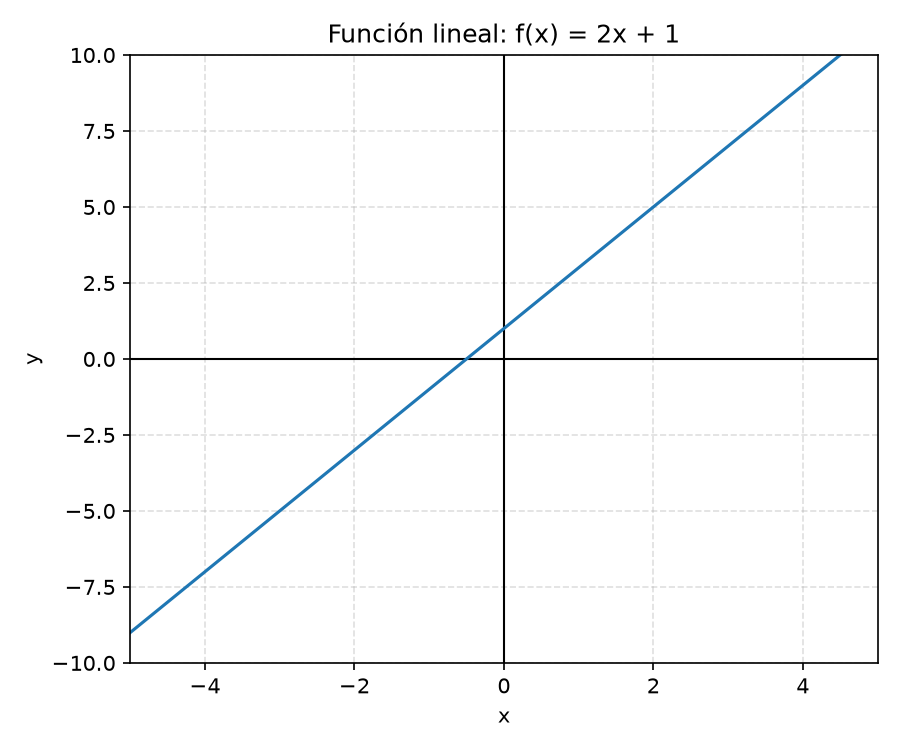
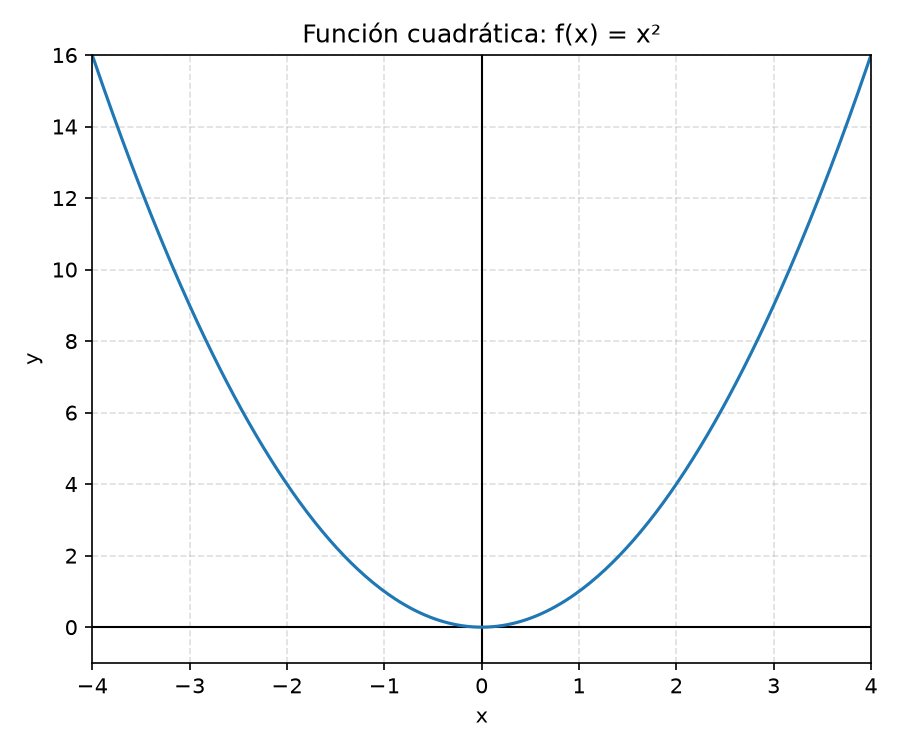
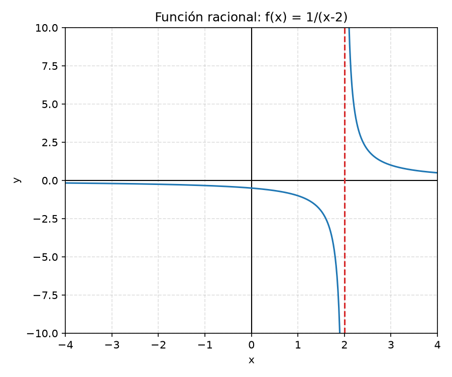
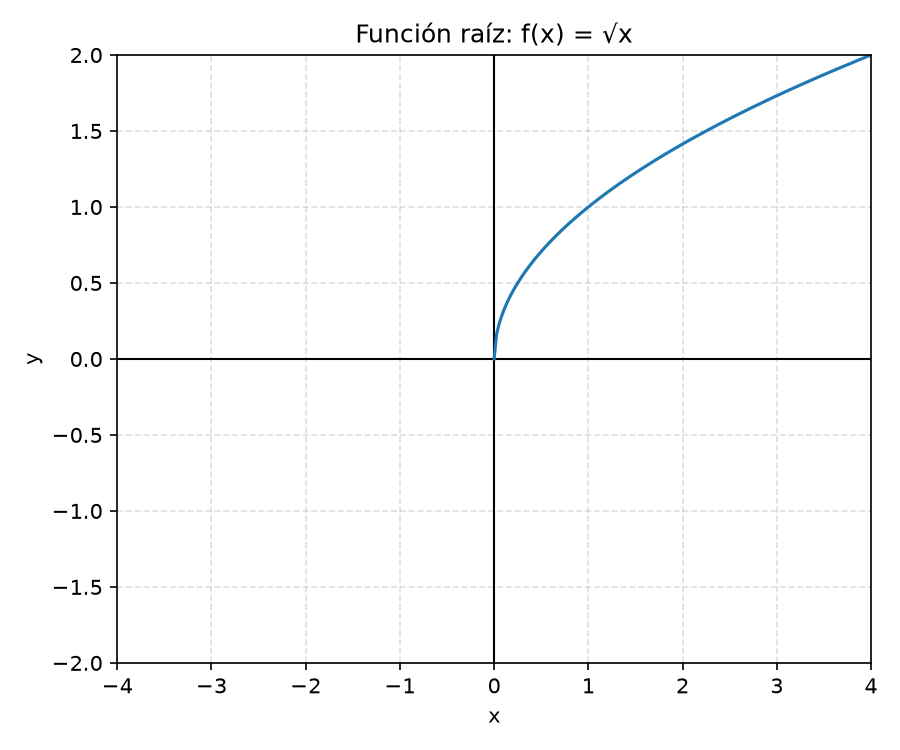

# 4️⃣ Funciones: concepto y tipos (explicado paso a paso)

Una función es como una **máquina**: le metes un número por un lado, y por el otro sale otro número, siguiendo siempre la misma regla.

---

## ¿Qué es una función?

Imagina una máquina que a cada número que le des, le suma 3. Si le das el 2, te devuelve el 5. Si le das el 10, te devuelve el 13.

Esa "máquina" se escribe así:

$$
f(x) = x+3
$$

- $x$ es lo que metes (la entrada).
- $f(x)$ es lo que sale (la salida).

Lo importante de una función es que **a cada entrada le corresponde una única salida**. Si metieras el mismo número dos veces, siempre te tendría que devolver el mismo resultado.

---

## Dominio y recorrido

- **Dominio:** todos los números que la máquina *puede aceptar* sin romperse.
- **Recorrido:** todos los resultados que la máquina *puede dar*.

### ¿Cuándo se "rompe" una función?

1. **Cuando hay una división y el denominador se hace 0.** No se puede dividir entre 0.

Ejemplo: $f(x)=\dfrac{1}{x-2}$ — no se puede calcular en $x=2$, porque el denominador sería 0. Entonces $x=2$ **no** está en el dominio.

2. **Cuando hay una raíz de índice par (cuadrada, cuarta...) y lo de dentro es negativo.** No existen (en los números reales) raíces cuadradas de números negativos.

Ejemplo: $f(x)=\sqrt{x}$ solo se puede calcular si $x\ge0$.

---

## Tipos de funciones básicas

### 1. Función lineal

$$
f(x)=mx+n
$$

Su gráfica es siempre una **línea recta**. $m$ es la pendiente (cuánto sube o baja la recta) y $n$ es donde corta al eje vertical.

Ejemplo: $f(x)=2x+1$

| $x$ | $f(x)$ |
|---|---|
| 0 | 1 |
| 1 | 3 |
| 2 | 5 |

### 2. Función cuadrática

$$
f(x)=ax^2+bx+c
$$

Su gráfica es una **parábola** (forma de "U" o de "U" invertida).

Ejemplo: $f(x)=x^2$

| $x$ | $f(x)$ |
|---|---|
| -2 | 4 |
| -1 | 1 |
| 0 | 0 |
| 1 | 1 |
| 2 | 4 |

Fíjate que para valores opuestos de $x$ (como -2 y 2), el resultado es el mismo. Por eso la parábola es simétrica.

### 3. Función racional

$$
f(x)=\frac{P(x)}{Q(x)}
$$

Es una fracción donde arriba y abajo hay polinomios. Su característica más importante para nosotros: **no existe donde el denominador $Q(x)$ se hace 0**. Ahí es donde suelen aparecer las asíntotas verticales.

Ejemplo: $f(x)=\dfrac{1}{x-2}$ no existe en $x=2$.

### 4. Función raíz

$$
f(x)=\sqrt{x}
$$

Solo existe para $x\ge0$ (no hay raíces cuadradas reales de números negativos).

---

## ¿Por qué es tan importante la función racional para los límites?

Casi todos los ejercicios de límites de este examen usan funciones racionales (fracciones de polinomios). Entender que:

- El denominador **no puede ser 0** en el dominio normal.
- Pero en un **límite**, precisamente nos interesa estudiar **qué pasa cerca** de esos puntos "prohibidos" (donde el denominador se anula).

es la clave para entender por qué existen las asíntotas verticales y los límites infinitos.

---

## 🧠 Por qué importa esto para los límites

Los límites estudian el comportamiento de una función **cerca** de un punto, especialmente en los puntos donde la función "se rompe" (denominador 0). Si no entiendes qué es una función, su dominio, y cómo se comportan las funciones racionales, es difícil entender por qué aparecen indeterminaciones o asíntotas.
