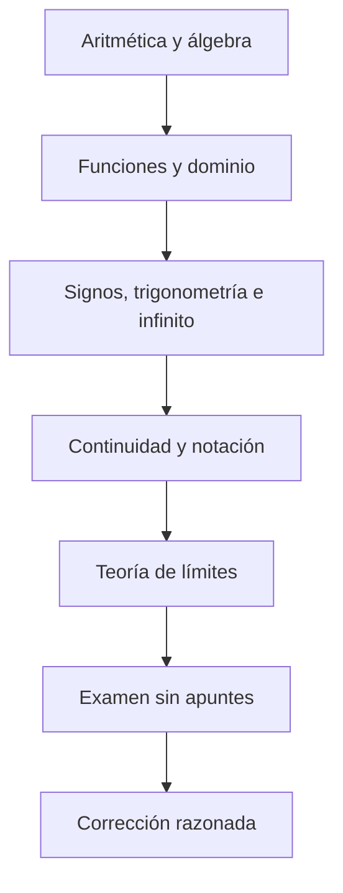

# 🧮 Pre-saberes — Lo que necesitas dominar antes de Límites

Antes de entender bien la teoría de límites hace falta tener soltura con una serie de conceptos previos. Aquí tienes el recorrido completo, de lo más básico a lo más cercano a límites.

---

## 1. [Aritmética y operaciones básicas](01-aritmetica.md)

- **Fracciones:** sumar, restar, multiplicar, dividir, simplificar.
- **Signos:** reglas de multiplicación/división de positivos y negativos ($+\cdot+=+$, $+\cdot-=-$, $-\cdot-=+$).
- **Potencias:** $a^n$, $a^0=1$ para $a\ne0$, $a^{-n}=\dfrac{1}{a^n}$, $a^{m/n}=\sqrt[n]{a^m}$ cuando la expresión está definida en $\mathbb R$.
- **Raíces:** propiedades como $\sqrt{ab}=\sqrt a\sqrt b$ para $a,b\ge0$ y racionalización de denominadores.
- **Jerarquía de operaciones:** paréntesis → potencias/raíces → multiplicación/división → suma/resta.

Sin esto, cualquier manipulación algebraica posterior (necesaria para resolver indeterminaciones) se vuelve muy difícil.

---

## 2. [Álgebra básica](02-algebra.md)

- **Expresiones algebraicas:** simplificar, agrupar términos semejantes.
- **Ecuaciones de primer y segundo grado:** despejar $x$, fórmula general $x=\dfrac{-b\pm\sqrt{b^2-4ac}}{2a}$.
- **Productos notables:**
  - $(a+b)^2=a^2+2ab+b^2$
  - $(a-b)^2=a^2-2ab+b^2$
  - $(a+b)(a-b)=a^2-b^2$ ← clave para indeterminaciones $0/0$
- **Factorización de polinomios:**
  - Factor común
  - Diferencia de cuadrados
  - Trinomio de segundo grado
  - Regla de Ruffini / división de polinomios (si $x=a$ es raíz, entonces $(x-a)$ es un factor)

Estas técnicas son **imprescindibles** para resolver la indeterminación $0/0$ en límites (factorizar y simplificar).

---

## 3. [Racionalización](03-racionalizacion.md)

Para racionalizar una diferencia de raíces, se multiplican numerador y denominador por el **conjugado**:

$$
\frac{1}{\sqrt{x}-\sqrt{a}}\cdot\frac{\sqrt{x}+\sqrt{a}}{\sqrt{x}+\sqrt{a}}=\frac{\sqrt{x}+\sqrt{a}}{x-a}
$$

Se usa para eliminar indeterminaciones $0/0$ cuando aparecen raíces en el numerador o denominador.

---

## 4. [Funciones: concepto y tipos](04-funciones.md)

- **Qué es una función:** relación que asocia a cada $x$ del dominio un único valor $f(x)$.
- **Dominio y recorrido:** valores de $x$ donde la función está definida (ojo con denominadores que se anulan y raíces de índice par con radicando negativo), con su notación formal $\text{Dom}(f)$, $\text{Im}(f)$ y la notación de intervalos $[a,b]$, $(a,b)$.
- **Gráficas de funciones básicas:**
  - Función lineal $f(x)=mx+n$
  - Función cuadrática $f(x)=ax^2+bx+c$ (parábola)
  - Función racional $f(x)=\dfrac{P(x)}{Q(x)}$
  - Función raíz $f(x)=\sqrt{x}$
  - Función a trozos (reglas distintas según el intervalo de $x$)
  - Función valor absoluto $f(x)=|x|$
  - Función exponencial $f(x)=a\cdot e^{bx}$ y logarítmica $f(x)=a\cdot\ln(x)$
- **Funciones racionales:** entender que no están definidas cuando el denominador es 0 y distinguir si aparece un agujero o una asíntota vertical.

---

## 5. [Grado de un polinomio](05-grado-polinomio.md)

- Identificar el **grado** de un polinomio (el mayor exponente).
- Saber comparar el grado del numerador y denominador en una fracción de polinomios — fundamental para límites en el infinito.
- **Coeficiente principal:** el que acompaña al término de mayor grado.

---

## 6. [Signo de una función / estudio de signos](06-estudio-signos.md)

- Saber determinar si una expresión es positiva o negativa en un intervalo (por ejemplo, sustituyendo un valor de prueba).
- Esto es clave para saber si un límite infinito es $+\infty$ o $-\infty$ según el signo del numerador y del denominador.

---

## 7. [Trigonometría básica](07-trigonometria.md)

- **Círculo unidad**, seno, coseno y tangente: $\tan x=\dfrac{\sin x}{\cos x}$.
- **Identidad fundamental:** $\sin^2(x)+\cos^2(x)=1$.
- **Funciones recíprocas:** cosecante, secante y cotangente ($\csc x$, $\sec x$, $\cot x$).
- Valores de $\sin$, $\cos$ y $\tan$ en ángulos notables ($0$, $\pi/6$, $\pi/4$, $\pi/3$, $\pi/2$).
- Signo de $\sin x$ y $\cos x$ según el cuadrante.
- Dónde se anula $\cos x$ (en $\pi/2+k\pi$) — importante para entender las asíntotas de la tangente.

---

## 8. [Concepto de infinito y de "acercarse a"](08-infinito-acercarse.md)

- Entender $\infty$ no como un número, sino como una idea de **crecimiento sin límite**.
- Entender qué significa estudiar valores de $x$ cada vez más próximos a $a$, dejando aparte el valor exacto $x=a$.
- Saber interpretar $\dfrac{1}{0^+} \to +\infty$ y $\dfrac{1}{0^-}\to-\infty$ (número finito dividido entre algo que se acerca a 0).

---

## 9. [Continuidad (idea intuitiva)](09-continuidad.md)

- Una función es continua en un punto si se puede dibujar sin levantar el lápiz.
- Los polinomios son siempre continuos.
- Las funciones racionales son continuas excepto donde se anula el denominador.
- Esto ayuda a saber cuándo se puede sustituir directamente (Ejercicio 1) y cuándo no.

---

## 10. [Notación que debes reconocer](10-notacion.md)

| Notación | Significado |
|---|---|
| $\lim_{x\to a}f(x)$ | Límite de $f$ cuando $x$ tiende a $a$ |
| $x\to a^-$ | $x$ se acerca a $a$ por la izquierda (valores menores) |
| $x\to a^+$ | $x$ se acerca a $a$ por la derecha (valores mayores) |
| $x\to+\infty$ | $x$ crece sin límite |
| $f(a)$ | Valor de la función en $x=a$ (puede no existir) |
| $0/0$, $\infty/\infty$ | Indeterminaciones |
| $[a,b]$, $(a,b)$ | Intervalo cerrado / abierto entre $a$ y $b$ |

---

## ✅ Checklist antes de empezar límites

- [ ] Sé operar con fracciones, potencias y raíces.
- [ ] Sé resolver ecuaciones de primer y segundo grado.
- [ ] Sé aplicar productos notables y factorizar polinomios.
- [ ] Sé racionalizar expresiones con raíces.
- [ ] Sé identificar el grado y coeficiente principal de un polinomio.
- [ ] Sé estudiar el signo de una expresión en un punto.
- [ ] Conozco las funciones básicas (lineal, cuadrática, racional, raíz, a trozos, valor absoluto, exponencial y logarítmica) y sus gráficas.
- [ ] Conozco seno, coseno, tangente, sus recíprocas y sus signos por cuadrante.
- [ ] Entiendo la idea intuitiva de infinito y de "acercarse a un valor".
- [ ] Entiendo qué es la continuidad de una función.
- [ ] Reconozco la notación de intervalos ($[a,b]$, $(a,b)$).

Si todos estos puntos están claros, la teoría de [teoria-limites.md](../teoria-limites.md) se entiende con mucha más facilidad.

## Ruta de estudio recomendada

1. Lee los temas en orden y reproduce los ejemplos sin mirar el desarrollo.
2. Usa los GIF para relacionar el cálculo simbólico con el movimiento en la gráfica.
3. Estudia la [teoría de límites](../teoria-limites.md).
4. Haz el [examen](../examen-limites-1.md) sin consultar apuntes.
5. Corrige tanto el resultado como la justificación con las [soluciones completas](../soluciones-examen-limites-1.md).

Para experimentar con tablas numéricas y cambiar valores, utiliza después el [laboratorio de límites con Python](../laboratorio-limites.ipynb). Es opcional y no sustituye la justificación algebraica.
