# ✅ Soluciones — Examen de Cálculo (Límites)

> [!TIP]
> Intenta cada ejercicio antes de consultar la solución. Al corregirte, comprueba no solo el resultado, sino también si has justificado el método y los signos.

---

## Ejercicio 1 — Cálculo directo

La expresión es un polinomio, y los polinomios son continuos en todo número real. Por eso se puede sustituir $x=2$ directamente:

$$
\lim_{x\to2}(3x^2-5x+4)=3(2)^2-5(2)+4=12-10+4=6
$$

**Resultado:** $6$.

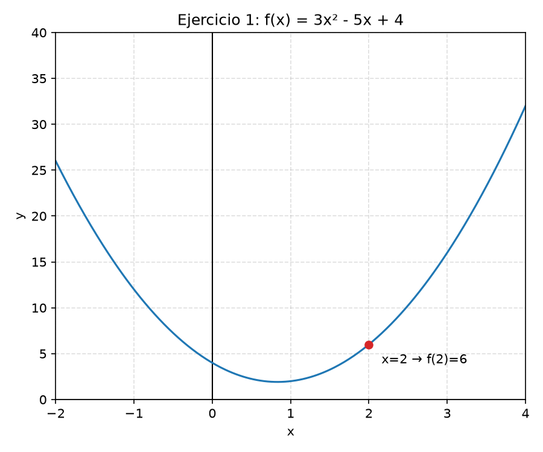

---

## Ejercicio 2 — Indeterminación $0/0$

Al sustituir $x=3$ se obtiene $0/0$. Esta forma es una **indeterminación**: no es el resultado del límite, sino una señal de que hay que transformar la expresión.

Factorizamos la diferencia de cuadrados:

$$
\frac{x^2-9}{x-3}
=\frac{(x-3)(x+3)}{x-3}
=x+3, \qquad x\ne3
$$

La simplificación es válida alrededor de $3$, aunque no en $x=3$. Ahora sí:

$$
\lim_{x\to3}(x+3)=6
$$

**Resultado:** $6$.

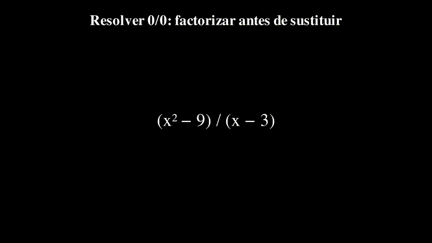

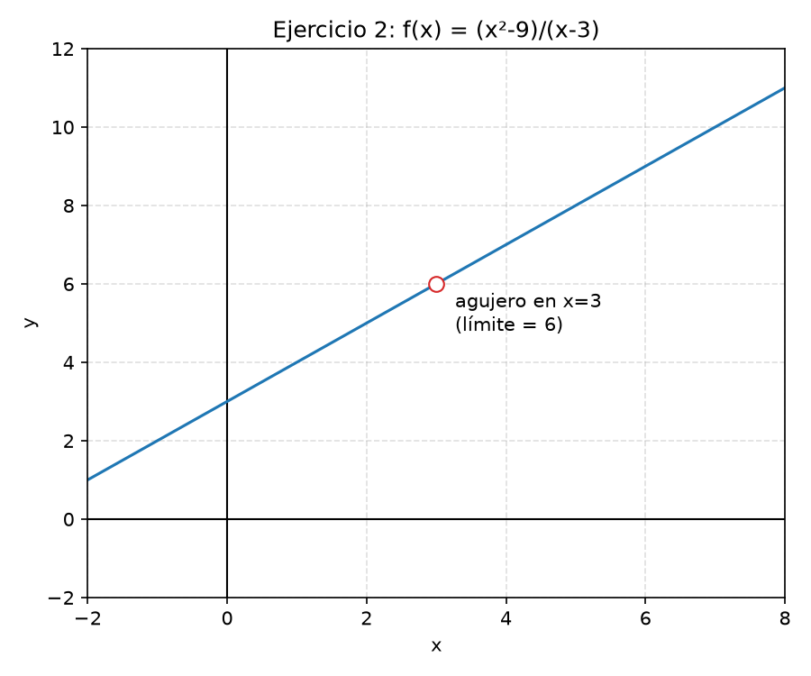

---

## Ejercicio 3 — Límites laterales e infinitos

Sea

$$
f(x)=\frac{x^2+x+2}{x+1}.
$$

En $x=-1$, el numerador se acerca a $2>0$ y el denominador se acerca a $0$. No aparece $0/0$: el signo del denominador decide hacia qué infinito se dirige el cociente.

- Si $x\to-1^-$, entonces $x+1\to0^-$ y $f(x)\to-\infty$.
- Si $x\to-1^+$, entonces $x+1\to0^+$ y $f(x)\to+\infty$.

Por tanto,

$$
\lim_{x\to-1^-}f(x)=-\infty,
\qquad
\lim_{x\to-1^+}f(x)=+\infty.
$$

Como los límites laterales no coinciden, **el límite bilateral no existe**. La recta $x=-1$ es una asíntota vertical.

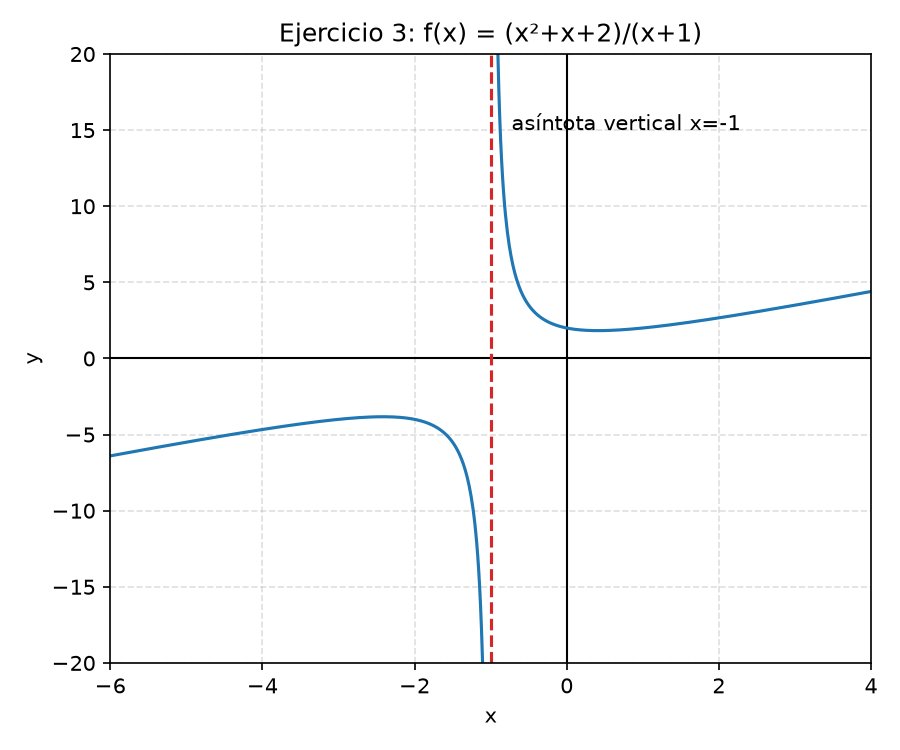

---

## Ejercicio 4 — Límite en el infinito

Numerador y denominador son de grado $2$. Dividimos todos los términos entre $x^2$:

$$
\begin{aligned}
\lim_{x\to+\infty}\frac{4x^2-3x+1}{2x^2+5x-7}
&=\lim_{x\to+\infty}\frac{4-\frac{3}{x}+\frac{1}{x^2}}{2+\frac{5}{x}-\frac{7}{x^2}} \\
&=\frac{4-0+0}{2+0-0}=2
\end{aligned}
$$

En el segundo paso hemos usado que $1/x\to0$ y $1/x^2\to0$.

**Resultado:** $2$. La recta $y=2$ es una asíntota horizontal cuando $x\to+\infty$.

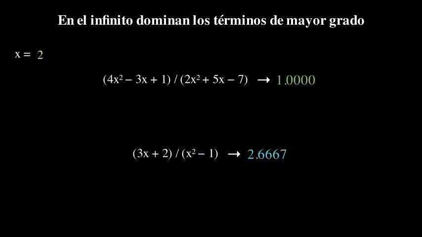

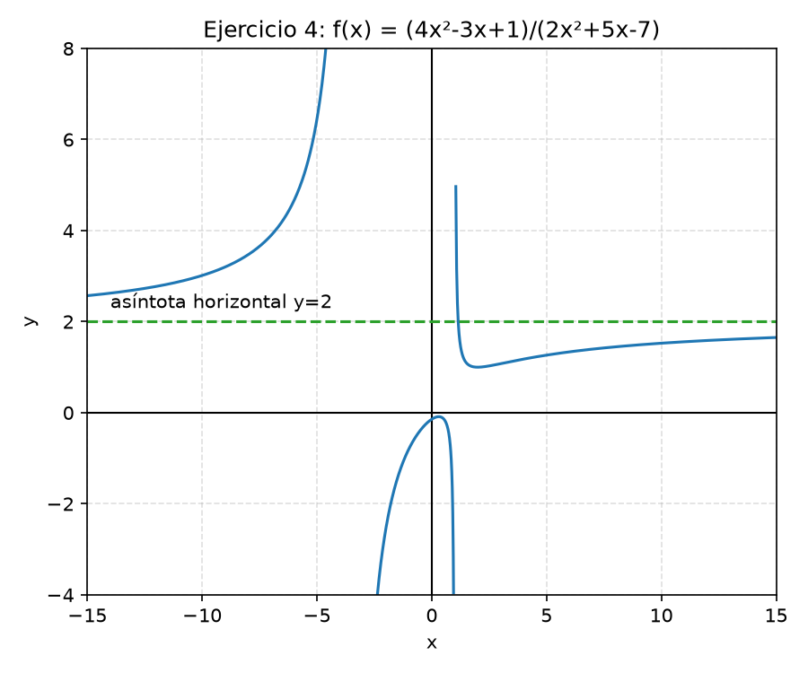

---

## Ejercicio 5 — Grados diferentes

El numerador tiene grado $1$ y el denominador grado $2$. Dividimos entre $x^2$:

$$
\begin{aligned}
\lim_{x\to+\infty}\frac{3x+2}{x^2-1}
&=\lim_{x\to+\infty}\frac{\frac{3}{x}+\frac{2}{x^2}}{1-\frac{1}{x^2}} \\
&=\frac{0+0}{1-0}=0
\end{aligned}
$$

**Resultado:** $0$. El denominador crece más rápido que el numerador, y $y=0$ es una asíntota horizontal.

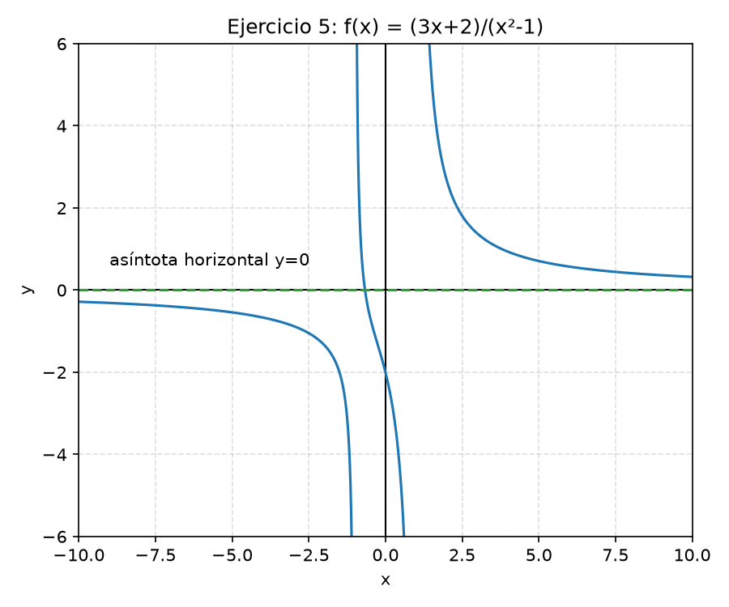

---

## Ejercicio 6 — Asíntota vertical

Para $f(x)=1/(x-2)$, el numerador es positivo y el denominador cambia de signo en $x=2$:

$$
\lim_{x\to2^-}\frac{1}{x-2}=-\infty,
\qquad
\lim_{x\to2^+}\frac{1}{x-2}=+\infty.
$$

Los laterales son distintos, así que **no existe el límite bilateral**. Sí existe una asíntota vertical, y es

$$
x=2.
$$

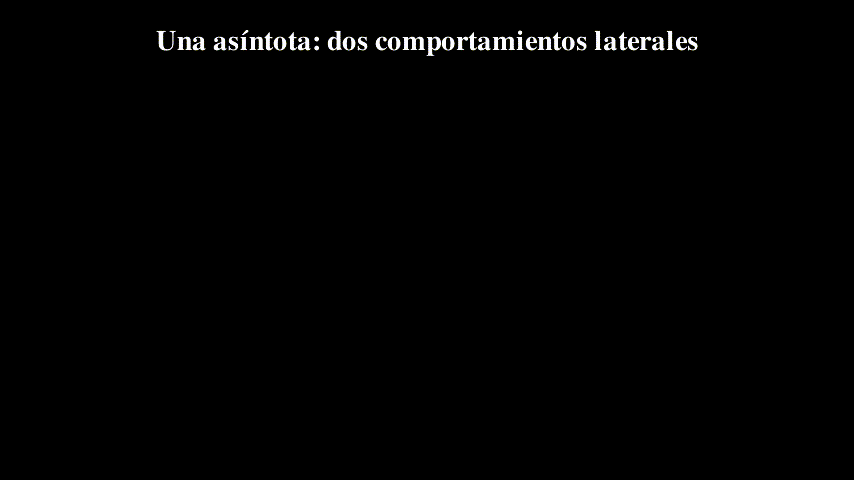

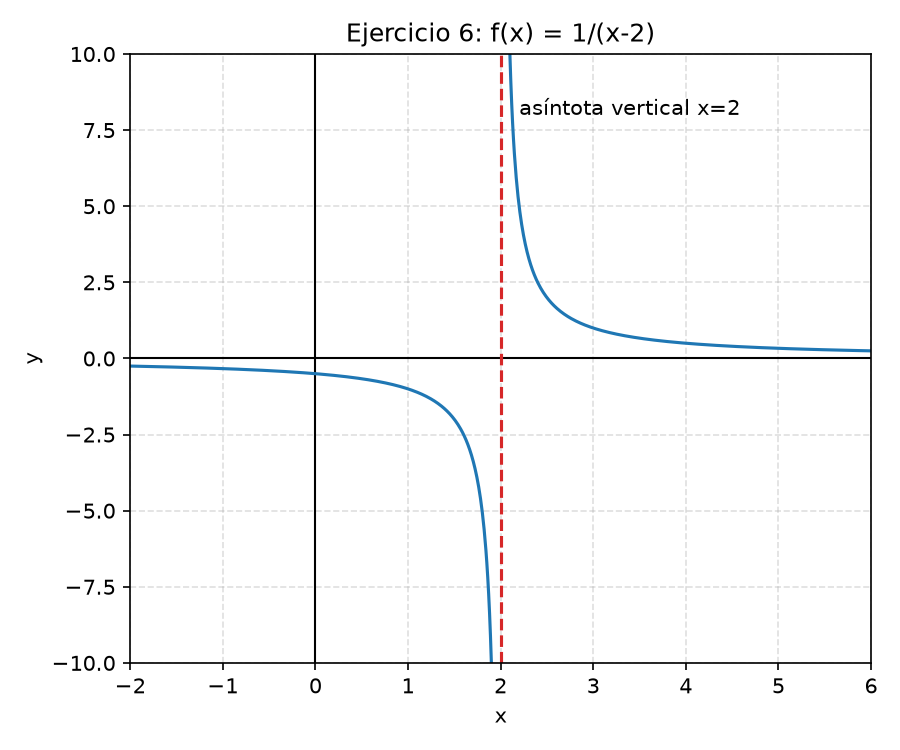

---

## Ejercicio 7 — Límite trigonométrico

Usamos que

$$
\tan x=\frac{\sin x}{\cos x}.
$$

Cerca de $\pi/2$, el seno se acerca a $1>0$. El coseno, en cambio, cambia de signo:

- Si $x\to(\pi/2)^-$, entonces $\cos x\to0^+$ y $\tan x\to+\infty$.
- Si $x\to(\pi/2)^+$, entonces $\cos x\to0^-$ y $\tan x\to-\infty$.

Por tanto,

$$
\lim_{x\to(\pi/2)^-}\tan x=+\infty,
\qquad
\lim_{x\to(\pi/2)^+}\tan x=-\infty.
$$

Como los laterales no coinciden, **el límite bilateral no existe**. La recta $x=\pi/2$ es una asíntota vertical.

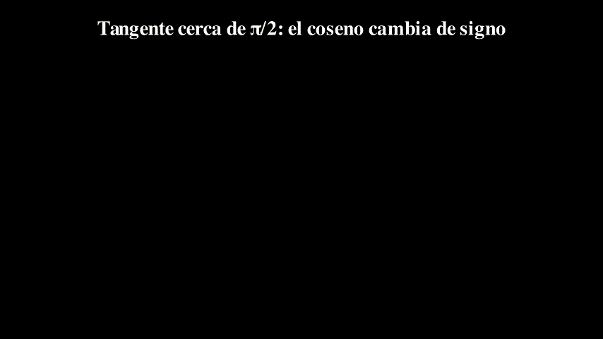

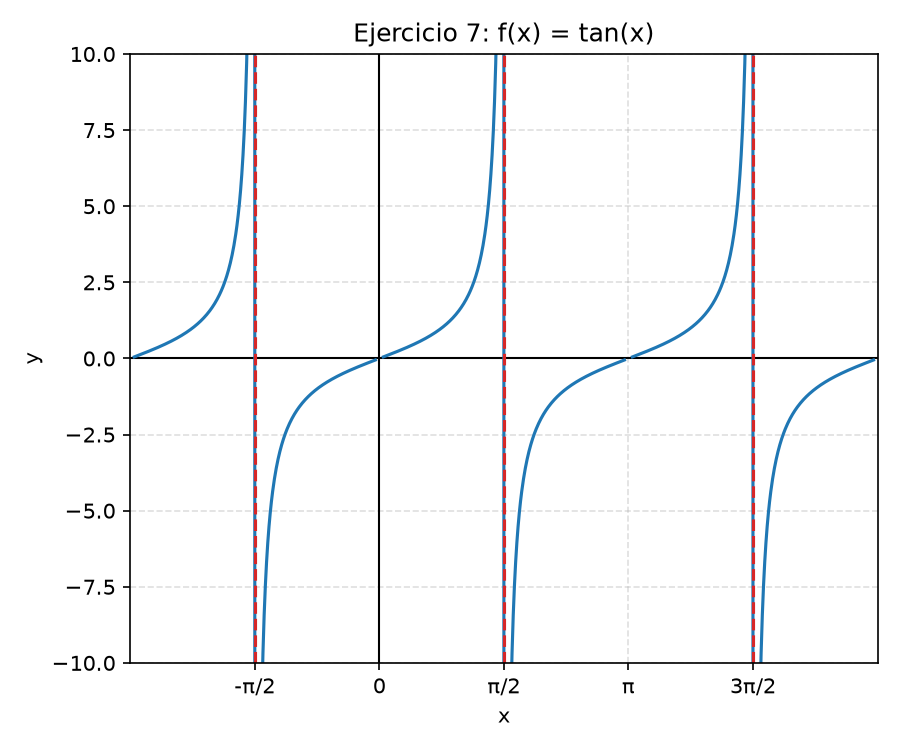

---

## Ejercicio 8 — Concepto de límite

La expresión

$$
\lim_{x\to a}f(x)=L
$$

significa que podemos hacer que $f(x)$ esté tan cerca de $L$ como queramos tomando valores de $x$ suficientemente cercanos a $a$, con $x\ne a$.

No es necesario que $f(a)=L$. De hecho, $f(a)$ puede ser distinto de $L$ o incluso no existir: el límite estudia los valores **alrededor** de $a$, no el valor aislado en $a$. Para que exista el límite bilateral, los límites por la izquierda y por la derecha deben existir y coincidir.

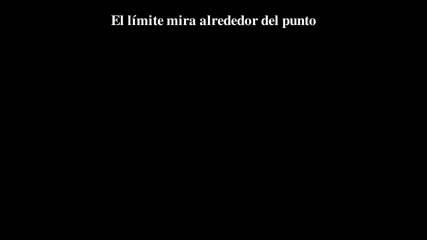

---

## Errores que conviene revisar

- Tratar $0/0$ como si fuese un resultado. Es una indeterminación.
- Cancelar términos de una suma en vez de factores completos.
- Escribir solo $\infty$ sin estudiar el signo y los dos laterales.
- Confundir $f(a)$ con $\lim_{x\to a}f(x)$.
- Aplicar la regla de los grados sin identificar primero el grado y el coeficiente principal.

## Resumen de corrección

| Ejercicio | Idea decisiva | Resultado |
|---|---|---:|
| 1 | Continuidad y sustitución directa | $6$ |
| 2 | Factorizar una diferencia de cuadrados | $6$ |
| 3 | Estudiar los dos signos laterales | No existe; $-\infty$ y $+\infty$ |
| 4 | Cociente de coeficientes principales | $2$ |
| 5 | El denominador tiene mayor grado | $0$ |
| 6 | Signo de $x-2$ a cada lado | No existe; asíntota $x=2$ |
| 7 | Signo del coseno a cada lado de $\pi/2$ | No existe; asíntota $x=\pi/2$ |
| 8 | El límite estudia el entorno | No exige que $f(a)=L$ |
